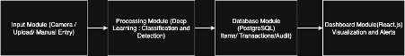
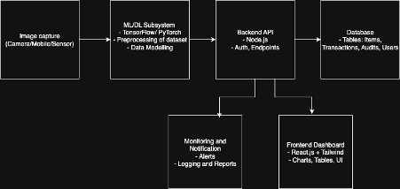

# AI-Powered Inventory Management System

## Table of Contents
- [Team Names and Project Abstract](#team-names-and-project-abstract)
- [Project Description](#project-description)
- [User Stories and Design Diagrams](#user-stories-and-design-diagrams)
  - [User Stories](#user-stories)
  - [Design Diagrams](#design-diagrams)
  - [Description of the Diagrams](#description-of-the-diagrams)
- [Project Tasks and Timeline](#project-tasks-and-timeline)
  - [Task List](#task-list)
  - [Timeline And Effort Matrix](#timeline-and-effort-matrix)
    - [Timeline](#timeline)
    - [Effort Matrix](#effort-matrix)
- [ABET Concerns Essay](#abet-concerns-essay)
- [PPT Slideshow](#ppt-slideshow)
- [Self-Assessment Essays](#self-assessment-essays)
- [Professional Biographies](#professional-biographies)
- [Budget](#budget)
- [Appendix](#appendix)
---

## Team Names and Project Abstract

**Team Name:** SSA  
**Advisor:** Hrishikesh Bhide  

### Team Members
- **Name:** Sabal Dahal  
  **Major:** Computer Science  
  **Email:** [dahalsl@mail.uc.edu](mailto:dahalsl@mail.uc.edu) | [sabal.dahal@outlook.com](mailto:sabal.dahal@outlook.com)  

- **Name:** Saugat Neupane  
  **Major:** Computer Science  
  **Email:** [neupansa@mail.uc.edu](mailto:neupansa@mail.uc.edu)  

- **Name:** Aayush Pokhrel  
  **Major:** Computer Science  
  **Email:** [pokhreah@mail.uc.edu](mailto:pokhreah@mail.uc.edu)  

**Project Abstract:**  
- Our project focuses on an AI-powered inventory management system that combines deep learning for image recognition with an automated backend database for real-time stock tracking. The system allows users to add, remove, and monitor inventory via a dashboard using technologies like TensorFlow, PostgreSQL, and React. It minimizes manual entry, provides alerts for low-stock conditions, and supports operational efficiency.
---

## Project Description

- Efficient inventory management is crucial for warehouses, retail stores, and laboratories. Our solution automates traditional manual tracking methods by integrating deep learning, backend database management, and visualization. The system captures images, recognizes stock items, and updates database counts seamlessly while supporting operational decision-making.
---

## User Stories and Design Diagrams

### User Stories
- [User_Stories.md](User_Stories.md)

1. As a warehouse manager, I want real-time, automated stock tracking to reduce human error and prevent reporting delays.
2. As a retail store employee, I want to scan/update items via image recognition for quick, spreadsheet-free processing.
3. As a business owner, I want low-stock alerts so I can restock items and avoid lost sales.
4. As a data analyst, I want access to inventory trends to inform decision-making.
5. As a laboratory technician, I want accurate inventory tracking to minimize waste and ensure compliance.

### Design Diagrams
Design diagrams are stored in the `Design_Diagrams` folder:

Fig: Level 0: Overall architecture showing input (images), processing (AI/ML), database, and dashboard/output.

Fig: Level 1: Data flow between input module, ML image processing, backend, dashboard.

Fig: Level 2: Component breakdown—camera/upload, deep learning subsystem, database tables, backend API, frontend dashboard.

### Description of the Diagrams

Design diagrams follow modular conventions, with components labeled for input, processing, storage, and visualization.  
Each diagram is structured to clarify how images are captured, processed using deep learning, routed to the database backend, and finally visualized and alerted on the dashboard.

---

## Project Tasks and Timeline

### Task List
- [Homework/Tasklist.md](Homework/Tasklist.md)
- Research ML models for inventory recognition (Sabal)
- Collect and preprocess image datasets (Sabal)
- Design ML training pipeline (Sabal)
- Train and evaluate models (Sabal)
- Refine model and architecture (Sabal)
- Specify database schema (Aayush)
- Develop backend API (Aayush)
- Integrate ML model with backend (Aayush)
- Implement authentication/user management (Aayush)
- Test backend modules (Aayush)
- Design dashboard UI (Saugat)
- Develop user-facing features (Saugat)
- Implement notifications/alerts (Saugat)
- Validate UI/UX (Saugat)
- Document frontend code (Saugat)
- Integrate all subsystems (Team)
- System-wide functional testing (Team)
- Evaluate system performance (Team)
- Prepare documentation/final demo (Team)

This file enumerates project-specific activities, responsible team members, and the technologies used.

### Timeline and Effort Matrix

[View Timeline and Effort Matrix](Homework/Milestone,%20Timeline%20and%20Effort%20Matrix.pdf)

#### Timeline

| Task | Task Description                   | Responsible | Start Date     | End Date       | Milestone |
|------|------------------------------------|-------------|----------------|----------------|-----------|
| 1    | Research DL models                 | Sabal       | Oct 7, 2025    | Oct 31, 2025   | M1        |
| 2    | Collect / preprocess images        | Sabal       | Oct 7, 2025    | Nov 15, 2025   | M2        |
| 3    | Design ML training pipeline        | Sabal       | Oct 20, 2025   | Nov 10, 2025   | M2        |
| 4    | Train / evaluate baseline model    | Sabal       | Nov 11, 2025   | Dec 1, 2025    | M2        |
| 5    | Refine model architecture          | Sabal       | Dec 2, 2025    | Dec 15, 2025   | M2        |
| 6    | Specify database schema            | Aayush      | Nov 10, 2025   | Nov 20, 2025   | M3        |
| 7    | Develop backend API                | Aayush      | Nov 21, 2025   | Dec 15, 2025   | M3        |
| 8    | Integrate ML with backend          | Aayush      | Jan 5, 2026    | Jan 20, 2026   | M3        |
| 9    | Implement authentication           | Aayush      | Jan 5, 2026    | Jan 20, 2026   | M3        |
| 10   | Test backend modules               | Aayush      | Jan 21, 2026   | Jan 31, 2026   | M3        |
| 11   | Design dashboard UI                | Saugat      | Nov 21, 2025   | Dec 15, 2025   | M4        |
| 12   | Develop monitoring features        | Saugat      | Jan 5, 2026    | Jan 25, 2026   | M4        |
| 13   | Implement alerts / notifications   | Saugat      | Jan 26, 2026   | Feb 10, 2026   | M4        |
| 14   | Validate UI/UX                     | Saugat      | Feb 11, 2026   | Feb 20, 2026   | M4        |
| 15   | Document frontend code             | Saugat      | Feb 21, 2026   | Feb 28, 2026   | M4        |
| 16   | Integrate subsystems               | Team        | Mar 1, 2026    | Mar 10, 2026   | M5        |
| 17   | Conduct system-wide testing        | Team        | Mar 11, 2026   | Mar 20, 2026   | M5        |
| 18   | Evaluate performance / refine      | Team        | Mar 11, 2026   | Mar 20, 2026   | M5        |
| 19   | Prepare project documentation      | Team        | Mar 21, 2026   | Mar 28, 2026   | M6        |
| 20   | Final demo                         | Team        | Apr 1, 2026    | Apr 5, 2026    | M6        |

#### Effort Matrix

The effort matrix document provides percentage or hour allocation per member:

| Task # | Task Description                   | Sabal (%) | Aayush (%) | Saugat (%) |
|--------|------------------------------------|-----------|------------|------------|
| 1      | Research DL models                 | 70.0      | 15.0       | 15.0       |
| 2      | Collect / preprocess images        | 70.0      | 15.0       | 15.0       |
| 3      | Design ML training pipeline        | 70.0      | 15.0       | 15.0       |
| 4      | Train / evaluate baseline model    | 70.0      | 15.0       | 15.0       |
| 5      | Refine model architecture          | 70.0      | 15.0       | 15.0       |
| 6      | Specify database schema            | 15.0      | 70.0       | 15.0       |
| 7      | Develop backend API                | 15.0      | 70.0       | 15.0       |
| 8      | Integrate ML with backend          | 15.0      | 70.0       | 15.0       |
| 9      | Implement authentication           | 15.0      | 70.0       | 15.0       |
| 10     | Test backend modules               | 15.0      | 70.0       | 15.0       |
| 11     | Design dashboard UI                | 15.0      | 15.0       | 70.0       |
| 12     | Develop monitoring features        | 15.0      | 15.0       | 70.0       |
| 13     | Implement alerts / notifications   | 15.0      | 15.0       | 70.0       |
| 14     | Validate UI/UX                     | 15.0      | 15.0       | 70.0       |
| 15     | Document frontend code             | 15.0      | 15.0       | 70.0       |
| 16     | Integrate subsystems               | 33.3      | 33.3       | 33.3       |
| 17     | Conduct system-wide testing        | 33.3      | 33.3       | 33.3       |
| 18     | Evaluate performance / refine      | 33.3      | 33.3       | 33.3       |
| 19     | Prepare project documentation      | 33.3      | 33.3       | 33.3       |
| 20     | Present final demo                 | 33.3      | 33.3       | 33.3       |

---

## ABET Concerns Essay

[Project Constraint Essay](Homework/Project%20Constraint%20Essay.pdf)

This essay discusses economic, professional, ethical, and security constraints, the use of open-source tools, and data privacy considerations.

---

## PPT Slideshow
[PPT Slideshow](Homework/PPT%20Slideshow.pptx)

This slideshow summarizes team members, goals, user stories, design diagrams, constraints, milestones, and the expected demo.

---

## Self-Assessment Essays

[Self Assessment - Sabal](Homework/Self%20Assessment/self-assessment_sabal.pdf)

[Self Assessment - Saugat](Homework/Self%20Assessment/self-assessment_saugat.pdf)

[Self Assessment - Aayush](Homework/Self%20Assessment/self-assessment_aayush.pdf)

Each essay reflects on academic preparation, technical competencies, co-op experiences, motivation, and measurable goals for contribution.

---

## Professional Biographies
Professional biographies are organized in the `Professional Bio` directory:

- Saugat Neupane 
[Biography](Professional%20Bio/Saugat/biography-saugat.md)
- Sabal Dahal
[Biography](Professional%20Bio/Sabal/biography-sabal.md)
- Aayush Pokhrel
[Biography](Professional%20Bio/Aayush/Aayush_bio.md)

These include contact information, co-op work experience, projects, skills, and project interests.

## Budget

- No expenses to date; all work has been conducted using university resources and open-source tools.
- No monetary value of donated items or external funding sources to report at this time.

If future expenses or donations occur, list them here with item descriptions, costs, and sources.

---

## Appendix

The appendix aggregates supporting documentation and evidence of effort:

- Team contract:  
  - [Homework/Senior Design Team Contract Draft.docx](Homework/Senior%20Design%20Team%20Contract%20Draft.docx)
- Links to code repositories:  
  - `https://github.com/sabaldahal/Senior-Design`
- Timeline and effort matrix files.
- Any additional references, research notes, or design documents.
---
